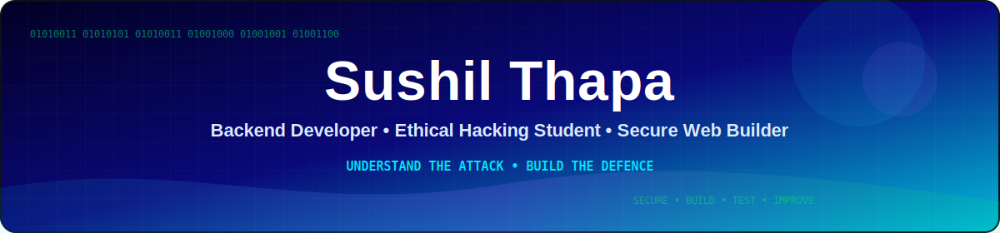
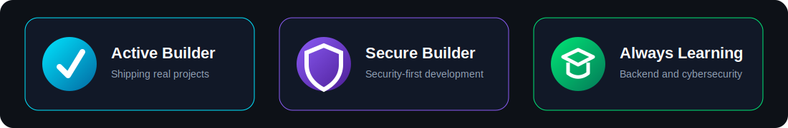
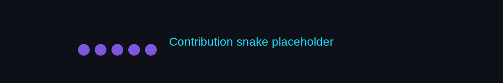

<div align="center">

<picture>
  <source media="(prefers-color-scheme: dark)" srcset="./assets/sushil-banner.svg">
  <source media="(prefers-color-scheme: light)" srcset="./assets/sushil-banner-light.svg">
  
</picture>

<br><br>


<br>


&nbsp;

&nbsp;


</div>

<br>

---

## `whoami`

```bash
$ cat /etc/profile.d/sushil.sh
```

```text
NAME        =  Sushil Thapa
ROLE        =  Backend Developer & Ethical Hacking Student
LOCATION    =  Nepal
FOCUS       =  Secure Web Applications | Backend Development | Penetration Testing
CURRENT     =  College LMS | E-commerce Platform | Cybersecurity Labs
PHILOSOPHY  =  "Understand the attack. Build the defence."
```

<br>

---

<table align="center" border="0">
<tr>
<td width="38%" align="center" valign="middle">



</td>
<td width="62%" valign="middle">

<h3>🚀 Featured Projects</h3>

<table>
<thead>
<tr>
<th align="left">Project</th>
<th align="center">Technologies</th>
<th align="center">Status</th>
</tr>
</thead>
<tbody>
<tr>
<td>
<a href="https://github.com/susilxreactor021-png/Susil_Id">🎓 Susil_Id</a>
</td>
<td align="center">
<code>React</code>
<code>React Native</code>
<code>Node.js</code>
<code>MongoDB</code>
</td>
<td align="center">🟢 Active</td>
</tr>
<tr>
<td>
<a href="https://github.com/susilxreactor021-png/E-commerce">🛒 Advanced E-commerce</a>
</td>
<td align="center">
<code>React</code>
<code>Node.js</code>
<code>Express</code>
<code>MongoDB</code>
</td>
<td align="center">🟡 Building</td>
</tr>
<tr>
<td>
<a href="https://sushilthapa200.com.np">🌐 Developer Portfolio</a>
</td>
<td align="center">
<code>React</code>
<code>JavaScript</code>
<code>CSS</code>
</td>
<td align="center">🔵 Live</td>
</tr>
<tr>
<td>
<a href="https://github.com/susilxreactor021-png?tab=repositories">🔐 Ethical Hacking Labs</a>
</td>
<td align="center">
<code>Kali Linux</code>
<code>Python</code>
<code>Burp Suite</code>
</td>
<td align="center">🧪 Learning</td>
</tr>
<tr>
<td>
<a href="https://github.com/susilxreactor021-png?tab=repositories">🛡️ Secure Backend APIs</a>
</td>
<td align="center">
<code>Laravel</code>
<code>PHP</code>
<code>MySQL</code>
<code>JWT</code>
</td>
<td align="center">🚧 In Progress</td>
</tr>
</tbody>
</table>

<br>

<blockquote>
🔐 <em>“Understand the attack. Build the defence.”</em>
</blockquote>

</td>
</tr>
</table>

<br>

---

## 🧩 Project Highlights

<table>
<tr>
<td width="50%" valign="top">

<h3 align="center">🎓 Susil_Id</h3>

A repository replacing the previous College LMS entry. View the project on GitHub.

<p align="center">
<a href="https://github.com/susilxreactor021-png/Susil_Id">

</a>
</p>

</td>
<td width="50%" valign="top">

<h3 align="center">🛒 Advanced E-commerce</h3>

A responsive shopping platform with a secure backend and complete administrative workflow.

<strong>Core features</strong>

<ul>
<li>Product search, filtering and sorting</li>
<li>Shopping cart and wishlist</li>
<li>Checkout and order tracking</li>
<li>Authentication and authorization</li>
<li>Product and inventory management</li>
<li>Administrative dashboard</li>
<li>Secure REST API architecture</li>
</ul>

<p>
<code>React</code>
<code>Node.js</code>
<code>Express</code>
<code>MongoDB</code>
<code>JWT</code>
</p>

<p align="center">
<a href="https://github.com/susilxreactor021-png/E-commerce">

</a>
</p>

</td>
</tr>
<tr>
<td width="50%" valign="top">

<h3 align="center">🔐 Ethical Hacking Labs</h3>

Legal and authorized practice environments for improving offensive and defensive security skills.

<strong>Learning areas</strong>

<ul>
<li>Web application security</li>
<li>Network reconnaissance</li>
<li>Vulnerability assessment</li>
<li>CTF challenges</li>
<li>Linux security</li>
<li>Penetration-testing methodology</li>
<li>Security reporting and remediation</li>
</ul>

<p>
<code>Kali Linux</code>
<code>Python</code>
<code>Burp Suite</code>
<code>Nmap</code>
<code>Wireshark</code>
</p>

</td>
<td width="50%" valign="top">

<h3 align="center">🌐 Developer Portfolio</h3>

A personal website presenting my projects, development skills and cybersecurity learning journey.

<strong>Core features</strong>

<ul>
<li>Responsive user interface</li>
<li>Project showcase</li>
<li>Skills and experience sections</li>
<li>Contact information</li>
<li>Smooth animations</li>
<li>Mobile-friendly layout</li>
<li>Fast production deployment</li>
</ul>

<p>
<code>React</code>
<code>JavaScript</code>
<code>CSS</code>
<code>Vercel</code>
</p>

<p align="center">
<a href="https://sushilthapa200.com.np">

</a>
</p>

</td>
</tr>
</table>

<br>

---

## 🛠️ Technology Stack

<div align="center">

<h3>Frontend</h3>


<h3>Backend</h3>


<h3>Database & Cloud</h3>


<h3>Development & Security</h3>


</div>

<br>

---

## 🔐 Security Interests

```text
┌── Security Areas
│
├── Web Application Security
├── Secure Backend Development
├── Authentication and Authorization
├── API Security
├── Network Reconnaissance
├── Vulnerability Assessment
├── Penetration Testing
├── Linux Security
└── Security Reporting
```

> Security testing is performed only in legal, authorized and controlled environments.

<br>

---

## 📊 GitHub Intelligence

<div align="center">


<br><br>


<br><br>


</div>

<br>

---

## 🏆 GitHub Achievements

<div align="center">



</div>

<br>

---

## 📈 Contribution Activity

<div align="center">


</div>

<br>

---

## 🐍 Contribution Snake

<div align="center">



</div>

<br>

---

## 🎯 2026 Goals

```text
[████████████░░░░░░░░]  60%   Master Node.js and Express security patterns
[████████░░░░░░░░░░░░]  40%   Continue the CEH or eJPT certification path
[██████████████░░░░░░]  70%   Ship a production-ready College LMS
[██████░░░░░░░░░░░░░░]  30%   Complete more authorized CTF challenges
[████████████░░░░░░░░]  60%   Complete E-commerce platform version 2
[██████████░░░░░░░░░░]  50%   Improve Laravel backend development
```

<br>

---

## 📚 Currently Learning

<div align="center">


&nbsp;

&nbsp;


</div>

<br>

---

## 📫 Connect With Me

<div align="center">

<a href="mailto:susilxreactor021@gmail.com">

</a>
&nbsp;
<a href="https://github.com/susilxreactor021-png">

</a>
&nbsp;
<a href="https://sushilthapa200.com.np">

</a>

<br><br>


<br><br>

<strong>🔐 Breaking and building securely.</strong>

<br><br>

<em>Always learning. Always building. Always improving.</em>

</div>

<br>


